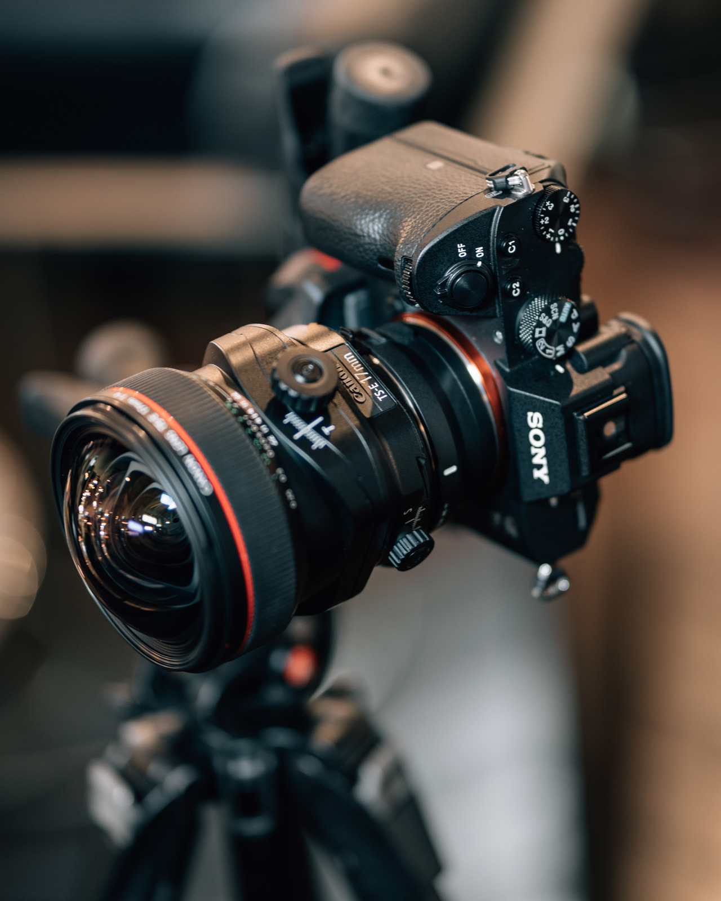
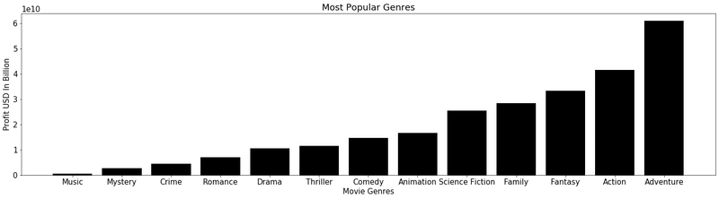

# Creating The Movies We Will Cherish Forever 

The Project:
Microsoft has hired me to conduct a data analysis and present my findings to them. From the data I will be able to gather the information needed to start a production company. I will also be able to give recommendations for what type of movies the company should focus on producing.

# The Goal
My goal is to gather the following information:
1. The most popular movies according to user vote
2. The budget it took to make the popular movies 
3. The revenue that was brought in by the popular movies 
4. The profit made from the popular movies 

# The Data
To start, I began by using The Movie Data Base API. I applied for an api key and recieved one a few minutes later. With this api key I was able to request for data on the most popular movies within a 30 year span (1989-2019). Once I recieved the urls that contained the results of my crieteria, I converted the urls raw data into a dataframe. The next step was to clean the data, or so I thought. 

After turning the raw data into a dataframe I viewed the columns and realized I was missing information. I went back to The Movie Data Base to gather the remaining information needed for my analysis. But, that left me with two seperate data frames. Not to worry, I was able to merge the two data frames together to make cleaning the raw data easier. 

Once I finished cleaning the raw data, I realized that the criteria I chose to grab my data had too many repeats of movies. My 45,000 movies list dropped to 460 movies. That was not enough to provide an accurate assesment of the movie industry. This is where Kaggle came into the picture. I had to obtain new movie data that was gathered from The Movie Data Base. The information I needed to conduct my analysis was all in one dataframe, so it was time to  do some cleaning.

# Cleaning The Data
With the new dataframe I was able to retrieve the information I was after. My data went from 7,000 to 5,000 after cleaning. I was happy that this data had a larger spread, which meant a more realistic analysis. What I did after was grab the top 100 movies to analyze.

# My Questions
1. What was the most popular genre 
2. How much did the genres gross
3. Who are the competitors/potential partners that gross the most profit

# My Findings
From the data analysis I found that the top genre of the most popular movies was Adventure, pulling about 60 billion USD. The top three genres were Adventure, Action, and Fantesy in that order.
The top three production companies were Walt Disney, Warner Brothers, & Walt Disney Pictures.

 
# How To Navigate MovieProj Repository
Below you will find a list of dataframes and their corresponding notebooks:

# CSV Files & Corresponding Notebooks

**The Dataframe with the raw data based off the 1989-2019 time frame and the notebook that contains the API proccess**

CSV: MostPopularMovies_89_19.csv

Notebook: https://github.com/bmor2552/MovieProj/blob/master/NoteBooks/Data_Grabbing2.ipynb

**The Dataframe that has raw movie data based off the movie id (needed this for revenue & budget info) and the notebook that contains the proccess**

CSV: Movies_by_id.csv

Notebook: https://github.com/bmor2552/MovieProj/blob/master/NoteBooks/Data_Grabbing2.ipynb

**The Dataframe that has the two dataframes merged together and the notebook that cleans it**

CSV: Merged_DataFrame2.ipynb

Notebook: https://github.com/bmor2552/MovieProj/blob/master/NoteBooks/Merged_DataFrame2.ipynb

**The Dataframe that was retrieved from Kaggle and the notbook that cleans it** (*The link to the kaggle data is in the notebook*)

CSV: Official_Movie_DataFrame

Notebook: https://github.com/bmor2552/MovieProj/blob/master/NoteBooks/Official_Movie_Notebook.ipynb

**The notebook that performs the analysis of the movie data**

Notebook: https://github.com/bmor2552/MovieProj/blob/master/NoteBooks/Statistical_Analysis.ipynb

# Presentation

https://www.canva.com/design/DAD1ygONAxc/rSd3qcSlql-6FJzzc1VdUQ/view?utm_content=DAD1ygONAxc&utm_campaign=designshare&utm_medium=link&utm_source=publishsharelink

